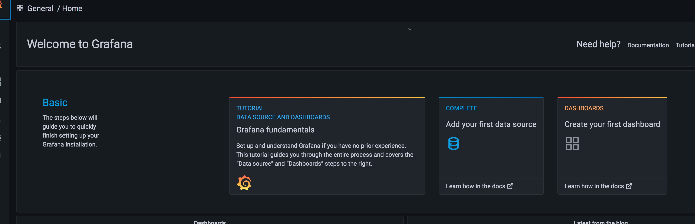
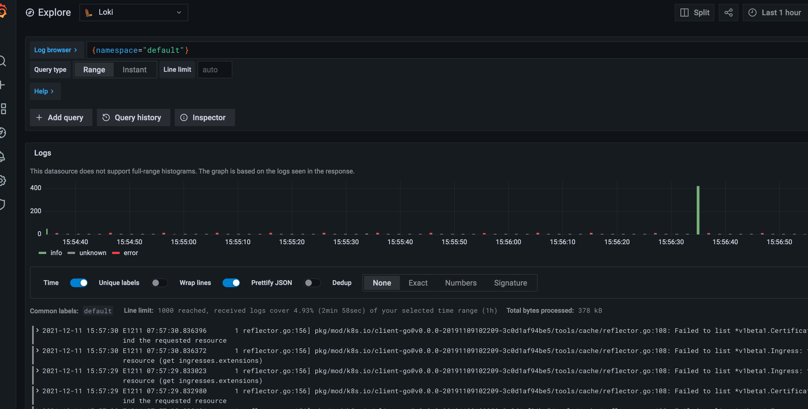

# 安装Loki stack

## 使用Helm安装
```shell
helm repo add grafana https://grafana.github.io/helm-charts
```

由于k8s集群比较新, 需要修改点东西
```shell
helm pull grafana/loki-stack
tar -xvf loki-stack-2.5.0.tgz
cd loki-stack
sed s#rbac.authorization.k8s.io/v1beta1#rbac.authorization.k8s.io/v1#g *.yaml

# 看看是否全部替换掉
find . -name "*.yaml" |xargs grep "rbac.authorization.k8s.io/v1beta1"
# 如果有未替换掉的, 手动替换一下, rbac.authorization.k8s.io/v1beta1  => rbac.authorization.k8s.io/v1

# 安装
helm upgrade --install loki ./loki-stack --set grafana.enabled=true,prometheus.enabled=true,prometheus.alertmanager.persistentVolume.enabled=false,prometheus.server.persistentVolume.enabled=false
```
等待各个组件启动完毕
```text
| loki-0                                                        ●                  1/1                                          1 Running                  10.0.1.217                     node2.idefav.com                  3h47m
│ loki-grafana-56b8d44c4d-wdjcz                                 ●                  1/1                                          1 Running                  10.0.1.224                     node2.idefav.com                  3h31m
│ loki-kube-state-metrics-7f9f667d7d-qmvbb                      ●                  1/1                                          1 Running                  10.0.1.172                     node2.idefav.com                  3h47m
│ loki-prometheus-alertmanager-9bb4c6f8f-gdvzf                  ●                  2/2                                          2 Running                  10.0.1.77                      node2.idefav.com                  3h47m
│ loki-prometheus-node-exporter-jng52                           ●                  1/1                                          1 Running                  192.168.0.108                  idefav.com                        3h47m
│ loki-prometheus-node-exporter-mn8l9                           ●                  1/1                                          1 Running                  192.168.0.107                  node2.idefav.com                  3h47m
│ loki-prometheus-pushgateway-664fd45795-g64hh                  ●                  1/1                                          1 Running                  10.0.1.134                     node2.idefav.com                  3h47m
│ loki-prometheus-server-5d6f9d5c6c-zckqz                       ●                  2/2                                          2 Running                  10.0.1.160                     node2.idefav.com                  3h47m
│ loki-promtail-52mgq                                           ●                  1/1                                          1 Running                  10.0.1.231                     node2.idefav.com                  3h47m
│ loki-promtail-w5p7b                                           ●                  1/1                                          1 Running                  10.0.0.193                     idefav.com                        3h47m
```
修改 `grafana` 的service type 为 LoadBalancer

**注意: 这里我是安装了 metallb 所以可以支持 LoadBalancer 的服务类型**

```yaml
apiVersion: v1
kind: Service
metadata:
  annotations:
    meta.helm.sh/release-name: loki
    meta.helm.sh/release-namespace: default
  creationTimestamp: "2021-12-11T04:00:18Z"
  labels:
    app.kubernetes.io/instance: loki
    app.kubernetes.io/managed-by: Helm
    app.kubernetes.io/name: grafana
    app.kubernetes.io/version: 8.1.6
    helm.sh/chart: grafana-6.16.12
  name: loki-grafana
  namespace: default
  resourceVersion: "173783"
  uid: e186c2df-15ab-4870-aee2-ec4de6dc0e25
spec:
  allocateLoadBalancerNodePorts: true
  clusterIP: 10.109.62.151
  clusterIPs:
  - 10.109.62.151
  externalTrafficPolicy: Cluster
  internalTrafficPolicy: Cluster
  ipFamilies:
  - IPv4
  ipFamilyPolicy: SingleStack
  ports:
  - name: service
    nodePort: 32745
    port: 80
    protocol: TCP
    targetPort: 3000
  selector:
    app.kubernetes.io/instance: loki
    app.kubernetes.io/name: grafana
  sessionAffinity: None
  type: LoadBalancer
```

等待获取到  `EXTERNAL-IP`

```text
kubectl get svc  loki-grafana
NAME           TYPE           CLUSTER-IP      EXTERNAL-IP     PORT(S)        AGE
loki-grafana   LoadBalancer   10.109.62.151   192.168.0.154   80:32745/TCP   3h52m
```


修改Grafana默认密码

```text
kubectl get secret loki-grafana
NAME           TYPE     DATA   AGE
loki-grafana   Opaque   3      3h53m
```

```text
apiVersion: v1
data:
  admin-password: YWRtaW4=
  admin-user: YWRtaW4=
  ldap-toml: ""
kind: Secret
```

密码也修改为 admin

这样通过 192.168.0.154 访问grafana



使用loki查看日志




## 发布应用
```shell
# 编译0.0.4版本并push镜像到dockerhub
make IMAGE=httpserver:0.0.4 push

helm upgrade idefav-httpserver ./idefav-httpserver/ -f ./idefav-httpserver/valuesWithMetrics.yaml
```