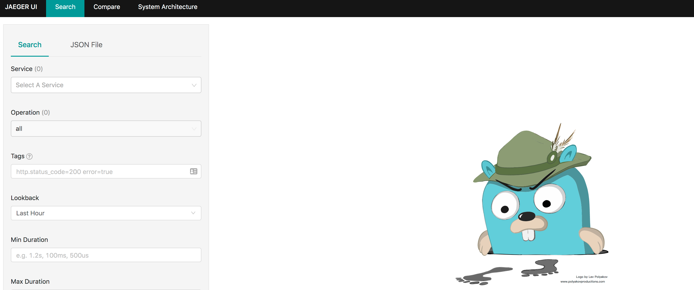
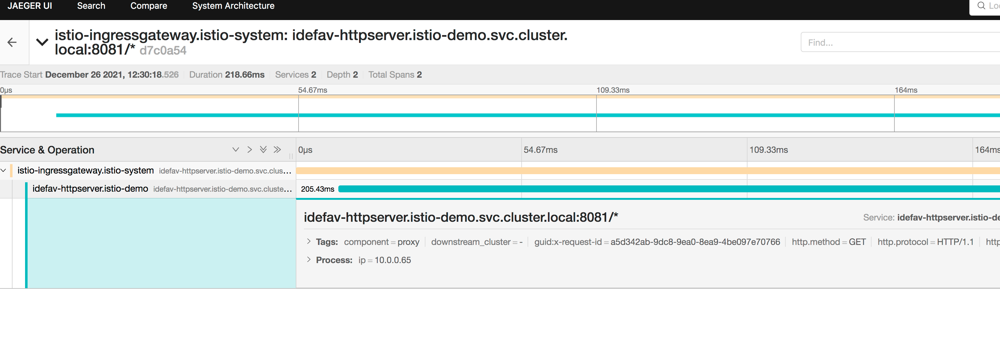
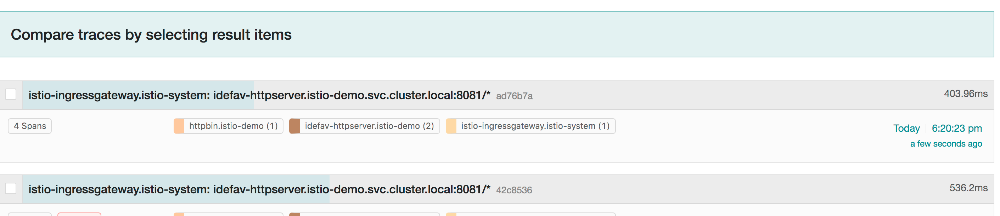
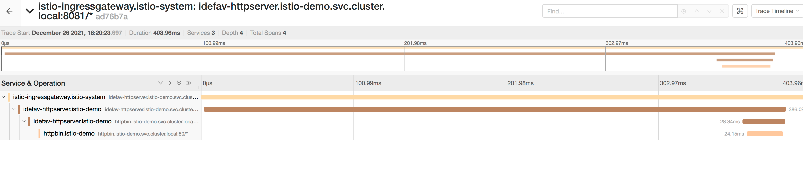

## 安装 Istio
```shell
curl -L https://istio.io/downloadIstio | sh -
cd istio-1.12.1/
cp bin/istioctl /usr/local/bin
istioctl install --set profile=demo -y
```
## 安装Jaeger
```shell
kubectl apply -f jaeger.yaml
```
查看jaeger svc ip
```shell
kubectl get -n istio-system svc
NAME                   TYPE           CLUSTER-IP      EXTERNAL-IP     PORT(S)                                                                      AGE
istio-egressgateway    ClusterIP      10.111.33.221   <none>          80/TCP,443/TCP                                                               18m
istio-ingressgateway   LoadBalancer   10.97.21.57     192.168.0.155   15021:30719/TCP,80:30424/TCP,443:30975/TCP,31400:30888/TCP,15443:31231/TCP   18m
istiod                 ClusterIP      10.96.107.96    <none>          15010/TCP,15012/TCP,443/TCP,15014/TCP                                        18m
jaeger-collector       ClusterIP      10.111.11.181   <none>          14268/TCP,14250/TCP,9411/TCP                                                 4m49s
tracing                LoadBalancer   10.109.121.87   192.168.0.156   80:30587/TCP,16685:30355/TCP                                                 4m49s
zipkin                 ClusterIP      10.101.70.78    <none>          9411/TCP                                                                     4m49s
```
使用浏览器访问 192.168.0.156



## 创建Istio 默认开启的 namespace
```shell
kubectl create ns istio-demo
kubectl label ns istio-demo istio-injection=enabled

```
# 设置tracing.sampling=100
```shell
kubectl edit configmap istio -n istio-system
```
```text
apiVersion: v1
data:
  mesh: |-
    accessLogFile: /dev/stdout
    defaultConfig:
      discoveryAddress: istiod.istio-system.svc:15012
      proxyMetadata: {}
      tracing:
        sampling: 100
        zipkin:
          address: zipkin.istio-system:9411
    enablePrometheusMerge: true
    rootNamespace: istio-system
    trustDomain: cluster.local
  meshNetworks: 'networks: {}'
kind: ConfigMap
```

## 部署到 istio-demo namespace
```shell
helm install idefav-httpserver --namespace=istio-demo ../idefav-httpserver/ -f ../idefav-httpserver/valuesWithMetrics.yaml --set ingress.enabled=false --set version=v1 --set image.tag=0.0.6
# 安装Istio spec
kubectl apply -f httpserver-istio.yaml -n istio-demo
```
访问试试
```shell
curl -H"host:demo.idefav.io" -i http://192.168.0.155/healthz
```
```text
HTTP/1.1 200 OK
content-type: application/json
date: Sun, 26 Dec 2021 03:29:12 GMT
content-length: 39
x-envoy-upstream-service-time: 426
server: istio-envoy
Proxy-Connection: keep-alive

{"code":0,"message":"","data":"Health"}
```
可以正常访问
## 给istio ingress gateway 新增安全秘钥
生成秘钥
```shell
mkdir secrets
cd secrets
openssl req -x509 -sha256 -nodes -days 365 -newkey rsa:2048 -subj '/O=idefav Inc./CN=*.idefav.io' -keyout idefav.io.key -out idefav.io.crt
kubectl create secret tls idefav-io-secret -n istio-system --cert=idefav.io.crt --key=idefav.io.key
cd ..
# install istio spec for idefav-httpserver
kubectl apply -f httpserver-istio-withTls.yaml -n istio-demo
# access healthz api
curl https://demo.idefav.io/healthz -k -i
HTTP/1.1 200 Connection established

HTTP/2 200
content-type: application/json
date: Sun, 26 Dec 2021 04:30:18 GMT
content-length: 39
x-envoy-upstream-service-time: 218
server: istio-envoy

{"code":0,"message":"","data":"Health"}

```
使用浏览器访问jaeger, 查看链路调用情况



## 更新版本为 v2
新增接口/httpbin/headers 接口, 发布v2版本, 但只有user=idefav的用户可以访问v2版本
```shell
kubectl apply -f httpbin.yaml -n istio-demo
kubectl apply -f httpserver-istio-versionUpgrade.yaml -n istio-demo
helm upgrade idefav-httpserver --namespace=istio-demo ../idefav-httpserver/ -f ../idefav-httpserver/valuesWithMetrics.yaml --set ingress.enabled=false --set newVersion=v2 --set newTag=0.0.14
```
查看endpoints:
```text
~ $ kubectl get -n istio-demo ep
NAME                ENDPOINTS                                                    AGE
httpbin             10.0.1.242:80                                                7m53s
idefav-httpserver   10.0.0.122:8081,10.0.0.155:8081,10.0.0.67:8081 + 3 more...   18m

~ $ kubectl get -n istio-demo vs
NAME                GATEWAYS                HOSTS                AGE
idefav-httpserver   ["idefav-httpserver"]   ["demo.idefav.io"]   16m

~ $ kubectl get -n istio-demo dr
NAME                HOST                                             AGE
idefav-httpserver   idefav-httpserver.istio-demo.svc.cluster.local   13m

~ $ kubectl get -n istio-demo po
NAME                                    READY   STATUS    RESTARTS   AGE
httpbin-74fb669cc6-tz28p                2/2     Running   0          9m31s
idefav-httpserver-7658f56d7-nx8xp       2/2     Running   0          19m
idefav-httpserver-7658f56d7-ts8d4       2/2     Running   0          19m
idefav-httpserver-7658f56d7-vwfxm       2/2     Running   0          19m
idefav-httpserver-new-87bcdd76c-4vkxb   2/2     Running   0          6m38s
idefav-httpserver-new-87bcdd76c-5d2mx   2/2     Running   0          6m26s
idefav-httpserver-new-87bcdd76c-xrjtc   2/2     Running   0          7m50s

$ kubectl get -n istio-demo deploy
NAME                    READY   UP-TO-DATE   AVAILABLE   AGE
httpbin                 1/1     1            1           9m50s
idefav-httpserver       3/3     3            3           20m
idefav-httpserver-new   3/3     3            3           17m
```
先使用普通用户访问
```shell
curl  https://demo.idefav.io/httpbin/headers -k -i
HTTP/2 404
content-type: application/json
date: Sun, 26 Dec 2021 07:47:29 GMT
content-length: 53
x-envoy-upstream-service-time: 1
server: istio-envoy

{"code":404,"message":"error: not found","data":null}
```
使用 header: user=idefav 访问试试
```text
~ $ curl -H"user:idefav"  https://demo.idefav.io/httpbin/headers -k -i
HTTP/2 200
content-type: application/json
date: Sun, 26 Dec 2021 07:50:51 GMT
content-length: 513
x-envoy-upstream-service-time: 599
server: istio-envoy

{"code":0,"message":"","data":{"headers":{"Accept-Encoding":"gzip","Host":"httpbin","User-Agent":"Go-http-client/1.1","X-B3-Parentspanid":"b9d309d6e5c7cd76","X-B3-Sampled":"1","X-B3-Spanid":"45d41e2eabae6b1d","X-B3-Traceid":"01f46aedc6a4f82cb9d309d6e5c7cd76","X-Envoy-Attempt-Count":"1","X-Forwarded-Client-Cert":"By=spiffe://cluster.local/ns/istio-demo/sa/httpbin;Hash=19774c4f5d05b39486e3848ef1c24726615d1925090a5c2336dbe7565778f7c0;Subject=\"\";URI=spiffe://cluster.local/ns/istio-demo/sa/idefav-httpserver"}}}
```
可访问新接口

## 新版本灰度白名单测试完成, 开始正式启用
```shell
helm upgrade idefav-httpserver --namespace=istio-demo ../idefav-httpserver/ -f ../idefav-httpserver/valuesWithMetrics.yaml --set ingress.enabled=false --set newVersion= --set newTag= --set image.tag=0.0.14
kubectl apply -f httpserver-istio-withTls.yaml -n istio-demo
```
普通用户现在可以访问新版本内容了
```text
~ $ curl  https://demo.idefav.io/httpbin/headers -k -i
HTTP/2 200
content-type: application/json
date: Sun, 26 Dec 2021 07:55:41 GMT
content-length: 513
x-envoy-upstream-service-time: 687
server: istio-envoy

{"code":0,"message":"","data":{"headers":{"Accept-Encoding":"gzip","Host":"httpbin","User-Agent":"Go-http-client/1.1","X-B3-Parentspanid":"e88b9414cd7c67fd","X-B3-Sampled":"1","X-B3-Spanid":"5150bf3b2acfaa5d","X-B3-Traceid":"479ed1e4557aa9e0e88b9414cd7c67fd","X-Envoy-Attempt-Count":"1","X-Forwarded-Client-Cert":"By=spiffe://cluster.local/ns/istio-demo/sa/httpbin;Hash=6f348e66c42ba6ac94d32a3b517cb5f41cd9e307bc3fd682cac6e0159e226030;Subject=\"\";URI=spiffe://cluster.local/ns/istio-demo/sa/idefav-httpserver"}}}
```

灰度用户也可以用
```text
~ $ curl -H"user:idefav"  https://demo.idefav.io/httpbin/headers -k -i
HTTP/2 200
content-type: application/json
date: Sun, 26 Dec 2021 07:56:18 GMT
content-length: 513
x-envoy-upstream-service-time: 264
server: istio-envoy

{"code":0,"message":"","data":{"headers":{"Accept-Encoding":"gzip","Host":"httpbin","User-Agent":"Go-http-client/1.1","X-B3-Parentspanid":"2d6b5b804282106e","X-B3-Sampled":"1","X-B3-Spanid":"f4ee8d24ed459f35","X-B3-Traceid":"7c78305091e270522d6b5b804282106e","X-Envoy-Attempt-Count":"1","X-Forwarded-Client-Cert":"By=spiffe://cluster.local/ns/istio-demo/sa/httpbin;Hash=aeecae80130a4362f5666ec40c78be8130fbf0ab52b5f41467e965718968f969;Subject=\"\";URI=spiffe://cluster.local/ns/istio-demo/sa/idefav-httpserver"}}}
```

查看链路情况, 链路使用opentracing 包把 istio-ingress-gateway的trace-id 传到 httpbin了, 所以链路是连起来的, 详情参照 项目 READE.md



